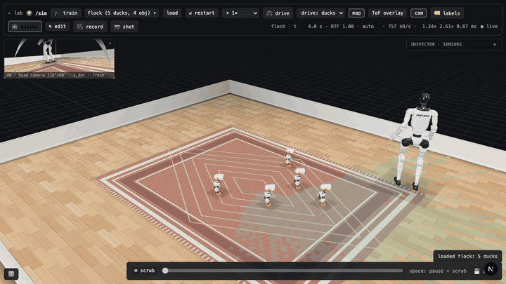
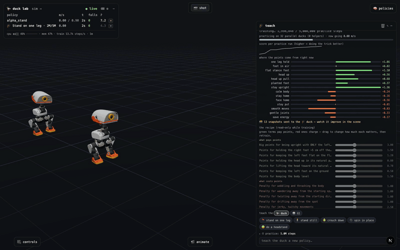
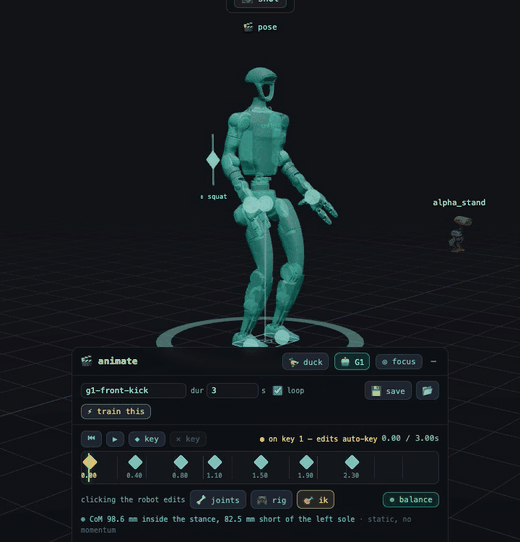
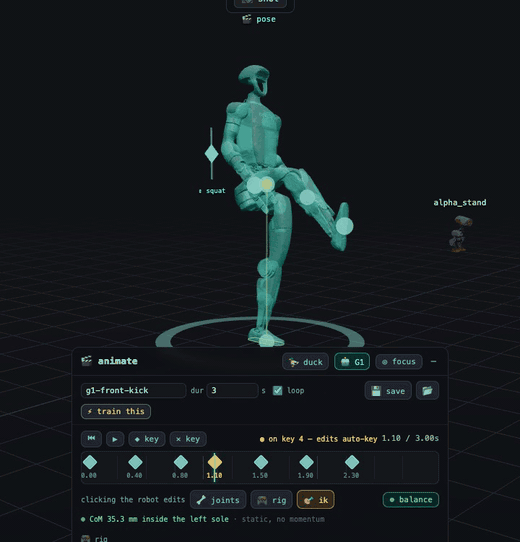
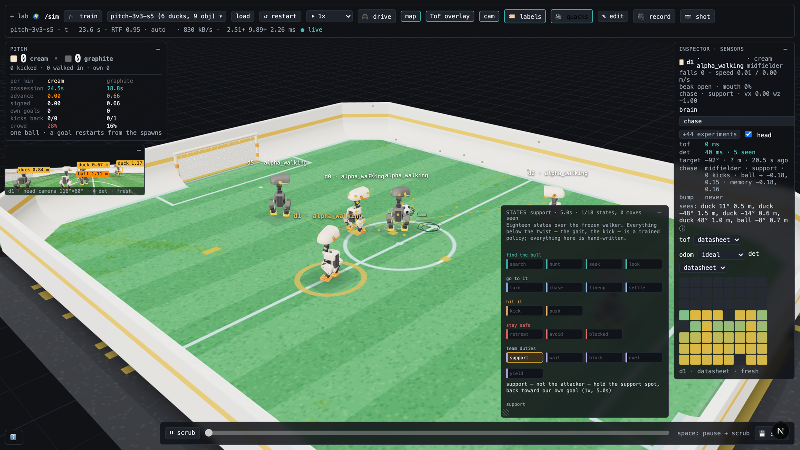
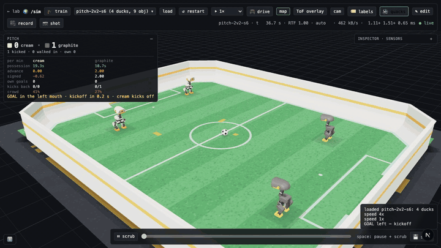
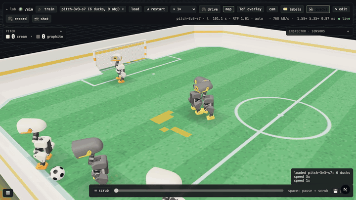
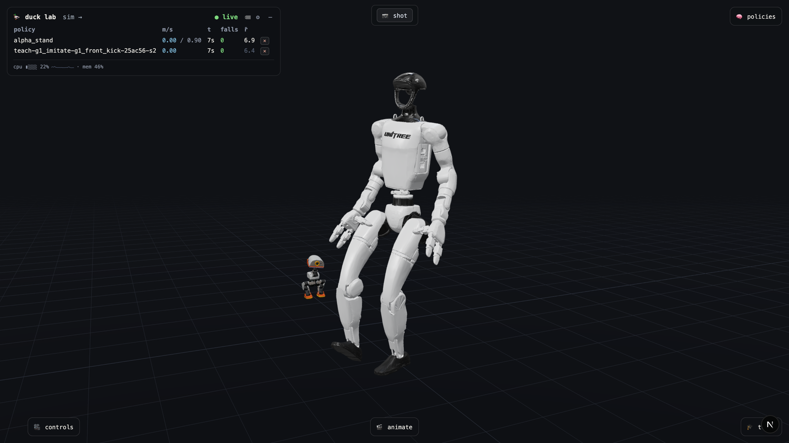
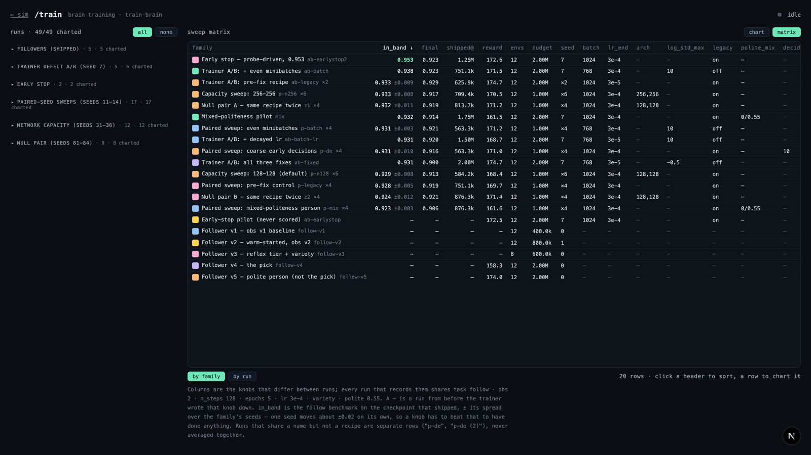

# Microduck Lab 🦆: RL experimentation on your Mac

Train reinforcement-learning policies for the
[Microduck](https://pollen-robotics.com/microduck), Pollen Robotics'
open-source ~25 cm bipedal robot, **on an ordinary Apple Silicon Mac with no
CUDA GPU**. Watch every policy walk, learn, and backflip live in your browser —
then put the ducks in a room with simulated senses and a brain, and watch them
follow a person, tidy a playroom, or play 3v3 soccer. Two more bodies ride the
same harness: Unitree's **G1** humanoid, and **MARS**, [Innate](https://www.innate.bot)'s
wheeled robot with an arm.


| Running (locally trained on CPU, BAM actuator physics) | Backflip showcase: spotter-assisted launch, policy landing, stand handoff |
|---|---|
|  |  |

| `/sim` soccer: 2v2 with roles, a kick selector and a scoreboard | `/sim` playroom: find a toy, pick it up in the beak, carry it to the basket (2x speed) |
|---|---|
|  |  |

| A second robot: a Unitree G1 kick, **drawn** with IK in the browser, then **learned** in physics | The brood: five ducks following a walking G1 (2x speed) |
|---|---|
|  |  |

## What's new (September 2026)

- **[`/sim`, the world page](#sim-rooms-senses-and-brains)** is built: whole
  rooms in one MuJoCo model, the robot's simulated senses (8×8 ToF depth,
  camera detector, odometry), a brain layer on top, a scenario editor, a
  timeline you can scrub, and a headless recorder.
- **[Robot soccer](#soccer-1v1-2v2-3v3)**: 1v1, 2v2 and 3v3 pitches with team
  roles, a kick selector, kicks retrained here, kickoffs, a live scoreboard —
  and a fallen duck that gets back up with a real policy instead of being
  teleported.
- **New behaviors**: a learned person-follower, a playroom **tidy** loop that
  carries toys to a basket in the beak, ball finding, a floor get-up.
- **[A second robot, the Unitree G1](#a-second-robot-the-unitree-g1)**: the
  29-joint humanoid trains, exports, renders and stands in the lab beside the
  ducks — and walks around `/sim` as the person the ducks follow.
- **[A third robot, Innate's MARS](#a-third-robot-innates-mars)**: a wheeled
  base with an arm, downloaded in 8 s, that drives a room, scans it with a
  360° LiDAR and tidies the playroom with its claw — **0.94** of the toys in
  five minutes against the duck's 0.83. A robot is a registry entry now rather
  than 45 `if robot == "g1"` literals, so a MuJoCo Menagerie model
  (`fetch-robot menagerie:unitree_go2`) also stands on the stage.
- **[IK in the 🎬 animate panel](#animate-keyframe-a-motion-then-make-it-real)**,
  for the duck and the G1: drag a foot, a hand or the centre of mass and the
  lab solves the joints. A 0.62 m G1 front kick was *drawn* in seven keyframes and then
  learned by imitation, after a day of reward search had topped out at 0.10 m.
- **[`/train`](#train-graphs-for-brain-training-runs)**: reward and
  episode-length charts for every brain-training run, a sweep matrix, and what
  differs between runs.

The official [microduck_rl](https://github.com/pollen-robotics/microduck_rl)
stack trains through MuJoCo Warp and needs a CUDA GPU. This project runs on the
laptop you already have. It's a prototyping loop for reward design, curricula,
and new tricks, built on the same MJCF robot model, the same 61-obs /
14-action deployment contract, and the same 50 Hz timing. A behavior you invent
here ports straight to the official stack for the final sim2real run, and the
ONNX you export is drop-in compatible with the official tooling.

**Not affiliated with Pollen Robotics, Innate or Unitree.** Two of Pollen's
repos are used as side-by-side checkouts (see setup); the G1 and MARS models
are downloaded at pinned shas from their upstream repositories and are not
vendored here.

## What's in the box

- **`microduck_local/`**: CPU-MuJoCo + Stable Baselines 3 PPO harness
  - `train-walk` / `train-behavior`: velocity-command walking and a library of
    teachable tricks, with mjlab-distilled rewards, symmetry augmentation,
    obs normalization, and a penalty-sign guard
  - Two actuator models: fast linearized XML servos, or the honest
    BAM XL330 voltage model (numba-fused) for maneuvers that saturate servos
  - `export-walk`: ONNX export with the obs normalizer baked in
  - `eval-walk`: headless eval battery (falls, command tracking)
  - `render-rollout`: mp4 for humans, **plus a captioned frame contact sheet
    an AI assistant can read**, carrying per-frame heights, angles, and
    contacts ([example](docs/media/contact-sheet.png))
  - `bench-walk` / `bench-envs`: find the right worker count for *your* machine
  - `duck-lab`: the streaming backend that drives the browser viewer
  - **World mode** (`duck-lab --world playroom`): rooms, pitches, people, toys
    and N ducks composed into one MuJoCo model; simulated senses in `sensors/`
    (the head's 8×8 ToF matrix, a camera-detector stand-in, drifting
    odometry, each with `ideal` / `datasheet` / `hostile` noise presets);
    brains in `brain/` that turn senses into the robot's own `robot.move` /
    `robot.head` intents
  - `record-world`: any world scenario, headless under a seed, to an mp4, a
    captioned contact sheet and an events log an agent can read
  - `eval-tidy` / `eval-pitch` / `eval-brain`: seeded, resumable benchmark
    batteries — the soccer and tidy numbers in the docs come from these, with
    the rejected experiments written down next to the shipped ones
  - `train-brain`: train the *brain* (the person-follower) with PPO, on top of
    a frozen walking policy
  - `--robot g1` / `--robot mars`: the trainer, exporter, renderer, lab and
    `/sim` are body-agnostic behind a `Body` registry
    ([`robots/`](microduck_local/src/microduck_local/robots)) — the 29-joint
    Unitree G1 (`fetch-g1`), Innate's wheeled MARS and its arm tasks
    (`fetch-robot mars`), and any MuJoCo Menagerie model as a
    stand-and-look body (`fetch-robot menagerie:unitree_go2`)
- **`duck-viewer/`**: Next.js + react-three-fiber viewer, three pages
  - **`/` the lab**: many robots side by side, live over WebSocket at 25 Hz;
    drag policy chips onto ducks to hot-swap brains mid-stride
  - **`/sim` the world**: one room, many ducks, what each one senses and
    thinks — see [below](#sim-rooms-senses-and-brains)
  - **`/train`**: charts for brain-training runs
  - **🎓 Teach panel**: ask for a built-in recipe ("stand on one leg") —
    keyword-matched, no LLM in the loop — see its reward recipe in
    plain English, watch the trainee improve every ~15 s as live snapshots
    hot-load, then drag the reward sliders and fine-tune. Reward shaping with
    no Python in the loop. The library now covers tricks, ball kicks, a floor
    get-up, ball finding, the G1's own tasks, and MARS's arm tasks.
  - Staged curricula for hard tricks (the backflip is 5 chained stages), with
    the viewer narrating the chain
  - **🎬 Animate panel**: a keyframe pose editor with a game-style control rig.
    Author a motion clip in the browser, then "train this" makes RL learn to
    physically execute it
  - **🎥 Capture panel**: 📷 for a full-res PNG, 🎥 to have the camera frame a
    duck and film it. The lab converts the take to an mp4 and a GIF you can
    paste straight into a PR
  - **⤓ ONNX download** on any run (the baked export, normalizer included), and
    **⚙ settings** to connect your own Hugging Face token (stored and
    validated today; the GPU-job launcher is not wired up yet)




## Quick start

Prereqs: macOS on Apple Silicon (Linux works too), [uv](https://docs.astral.sh/uv/),
Node 20+, ~3 GB of disk for the checkouts and models.

```bash
git clone https://github.com/jonathanhawkins/microduck-lab && cd microduck-lab
./scripts/setup.sh    # upstream clones at the pinned shas, the shipped policies
                      # from the Hub, uv sync, npm install, a smoke test

# …or by hand — the same steps, which AGENTS.md "Setup" lists with the pinned shas:
git clone https://github.com/pollen-robotics/microduck        # robot software, docs
git clone https://github.com/pollen-robotics/microduck_rl     # MJCF models, official stack
cd microduck_local
uv sync
# The shipped policies moved off the microduck repo and onto the Hub
# (https://huggingface.co/pollen-robotics/microduck-policies); the harness
# expects them in ../microduck/policies/. Same pinned revision as setup.sh:
uv run hf download pollen-robotics/microduck-policies \
  alpha_walking.onnx alpha_stand.onnx alpha_sitstand.onnx alpha_ground_pick.onnx \
  ball_kick_left.onnx ball_kick_right.onnx roller.onnx roller_crouch.onnx roulade.onnx \
  --revision 088524a64e2557dc453256b6071dbb9d23888802 --local-dir ../microduck/policies --quiet
uv run --with pytest pytest tests/        # contract tests, should be all green

# train your first walking policy (a few minutes on an M-series Mac)
uv run train-walk --envs 32 --steps 3_000_000 --run-name first-gait
uv run export-walk runs/first-gait
uv run eval-walk runs/first-gait/policy.onnx

# fire up the lab + viewer
uv run duck-lab runs/first-gait ../microduck/policies/alpha_walking.onnx
cd ../duck-viewer && npm install && npm run dev   # open the printed URL
```

Then open the 🎓 teach panel and ask the duck to "stand on one leg".

Or skip training and go straight to a world — no roster needed:

```bash
uv run duck-lab --world pitch-2v2     # or playroom, follow-me, living-room, pitch, pitch-3v3,
                                      # flock, mars-playroom, mars-follow
# then open http://localhost:63317/sim

uv run fetch-g1                       # optional: the Unitree G1 (~140 MB) for the lab,
                                      # the 🎬 panel, and the person the ducks follow
uv run fetch-robot mars               # optional: Innate's MARS (7.2 MB) for the lab,
                                      # its arm tasks, and the two mars- worlds
```

## Performance (measured, Apple M-series)

Every number below is reproduced in
[microduck_local/README.md](microduck_local/README.md) with its methodology,
including the experiments that got **rejected**.

- **~16.5k env-steps/s** on the shipped 32-env recipe (about 1 min per 1M
  steps); ~27k steps/s peak in throughput configs
- **One compiled MuJoCo model shared across all workers** (fork +
  copy-on-write): 64 envs dropped from **41 GB to 1.5 GB** of memory
- Semaphore + shared-memory IPC instead of pipes/pickles per step
- numba-fused BAM actuator kernels, bitwise-identical to the numpy reference
- Optional MPS (Apple GPU) PPO updates, auto-enabled only where they measured
  faster
- Two throughput "wins" (overlapped updates, big-batch) raised steps/s 25-40%
  but **halved learning per step** in seed-matched A/Bs, so they ship as
  opt-in flags rather than defaults. Reward per wall-second is the metric that
  matters.

## Teach the duck your own trick

Tricks are plain-English reward recipes in
[`behaviors/`](microduck_local/src/microduck_local/behaviors). A `Behavior` is
a set of reward terms, chat keywords, and optionally a staged curriculum for
the harder maneuvers. Add one, lock it with a test, and it shows up in the
viewer's teach panel with live sliders. The full playbook is in
[microduck_local/AGENTS.md](microduck_local/AGENTS.md): contract invariants,
reward-design rules, and the verification discipline that keeps you from
fooling yourself.

The teach panel only offers recipes that exist in `behaviors/`: an unrecognized
request returns the catalog rather than improvising one. There are **27** today
— the duck's tricks and kicks, the G1's own tasks, and MARS's two arm tasks —
and adding the next is a Python change; see
[Working with AI assistants](#working-with-ai-assistants) if you'd rather have
a coding agent draft it.

## Animate: keyframe a motion, then make it real

The 🎬 animate panel is a pose-and-timeline editor for authoring **reference
motion clips** in the browser, and the bridge from animation to RL.


- **Pose the duck directly** (click a body part, drag) or through the
  **🎮 control rig**, a set of animator-style macro handles (`squat`, `lean`,
  leg swings, `sway`, `stance`, `twist`, `toes`, `look`). Each control is a
  direction in joint space chosen so feet stay planted and the controls are
  mutually orthogonal: squatting never disturbs the lean slider, and a stride
  keyed over a crouch keeps the crouch. A ⇕ handle parks on the duck itself,
  and dragging it down is what drives the squat in the clip above.
- **🎯 IK**: drag a foot, a hand or the **centre of mass** and the lab solves
  the joints (damped least squares on the limb's own chain, joint limits
  honoured, the other feet pinned). "Weight over the left foot" is one drag of
  the ⊕ handle, and the hips move while the feet stay put. A toggleable
  centre-of-mass marker reads balance against the real sole outline, so you
  can see whether a pose is statically holdable before you train on it.

  | Drag the **centre of mass**: the hips shift, the feet stay, the balance read-out goes green | Drag a **foot**: the leg re-solves on the kick's apex keyframe |
  |---|---|
  |  |  |

- **🦆 / 🤖 switch**: the editor is built from a `RobotSpec`, so the same
  panel poses the Unitree G1 with its own 12 rig controls (squat, lean,
  swings, sway, stance, twist, toes, turn, bend, arms, elbows). Clips carry
  their robot.
- **Keyframe timeline** with auto-key, scrub/playback, and looping; the lab
  solves each pose server-side so the preview duck stays grounded. Clips save
  to [`microduck_local/clips/`](microduck_local/clips) as plain JSON
  (`run`, `sprint-cycle`, `backflip` and `g1-front-kick` ship as examples).
  `uv run render-clip g1-front-kick --out /tmp/rc` plays a clip back as an mp4
  and a contact sheet with the balance read burned in — look at a clip before
  you spend a training run on it.
- **⚡ Train this**: the clip becomes the reward. DeepMimic-style motion
  imitation ("be in the reference pose for right now") turns an open-ended
  search like *discover a backflip* into a tracking problem the policy can
  solve, without touching the 61-obs deployment contract. See
  [`motion.py`](microduck_local/src/microduck_local/motion.py).

## Capture: screenshots, video and GIFs, from the browser

The capture panel sits at the top of the viewer and turns whatever the lab is
doing right now into files you can drop into a PR or an issue. No screen
recorder, no ffmpeg incantation.


- **📷 shot** (always available) downloads a full-resolution PNG of the current
  view, named after the selected duck, or `duck-lab` for a crowd shot. The
  selection ring is hidden for the capture render, and the whole
  render → read → download runs inside the click's own user gesture, because
  Chrome silently drops a page's second "automatic" download.
- **🎥 record** (appears once you click a duck) films that one duck for you:
  the camera glides to a ¾ front shot chosen from its heading, then holds it
  with a slow drift while MediaRecorder captures the WebGL canvas. Orbit and
  the camera keys pause for the take, and the footage comes out clean because
  the labels and panels are DOM, not canvas.
- **■ stop** uploads the take to the lab
  ([`POST /captures`](microduck_local/src/microduck_local/viz_server.py)),
  whose bundled ffmpeg writes a full-resolution h264 **mp4** and a 480 px
  palette **gif** into `microduck_local/captures/`, and the panel offers both
  as ⬇ downloads. Takes cap at 60 s.

One gotcha: frames are pushed per *rendered* frame (`captureStream(0)` +
`requestFrame()`), because automatic capture rides the browser's compositor and
records almost nothing in a throttled tab. Keep the tab visible while
recording. A take where the scene never rendered gets refused with a message
instead of saved as a 0.1 s "video".

## `/sim`: rooms, senses and brains

The lab gives every duck a private training env. **World mode** composes a
whole room into *one* MuJoCo model — walls, furniture, a ball, toys, a walking
person, N ducks — so ducks bump into each other and a sensor on one can see
another. On top of the walking policy sits the stack the real robot has: what
it **senses**, and a **brain** that turns senses into the same `robot.move` /
`robot.head` intents the hardware takes. The brain never sees ground truth.



```bash
uv run duck-lab --world playroom      # then open http://localhost:63317/sim
```

- **Worlds**, and **where to start editing**. Six are built in and generated
  in code, so there is no file to open: `living-room`, `follow-me`,
  `playroom`, `pitch` (1v1), `pitch-2v2`, `pitch-3v3`. Three more ship as
  plain JSON in [`microduck_local/scenarios/`](microduck_local/scenarios), and
  **those are the ones to copy and expand from**:

  | file | `--world` | what it shows you |
  |---|---|---|
  | `flock.json` | `flock` | five ducks and a walking **G1** — a second body, and a person with a patrol path |
  | `mars-playroom.json` | `mars-playroom` | a **MARS** and six toys — manipulation, and a room with its own `physics_dt` |
  | `mars-follow.json` | `mars-follow` | a MARS and a walking person — the smallest useful room |

  Save one under a new name and it appears in the menu beside the built-ins
  (the built-in names are reserved — saving over one is refused).
  **`Shift+E`** opens the scenario editor (walls, boxes, ducks, a person's
  path, "make a pitch").
- **Senses you can see**: **`T`** draws the selected body's own range sensor —
  every zone of the duck's 8×8 ToF depth matrix where it *reports* it, or all
  360 rays of a MARS's planar LiDAR; **`V`** opens the duck's head camera
  with its live detections boxed (duck, person, ball, toy, basket, goal post);
  **`M`** paints the occupancy map the duck is building; the **inspector**
  (`I`) shows the depth heatmap, every observation slot and every action, and
  flips the noise preset live from `ideal` to `hostile`.
- **Brains**: `wander` (ToF-only reflexes), `follow` (scripted) and
  `learned:follow-v4` (trained here with `train-brain`), `tidy`, `tidy_arm`
  (the same loop done with MARS's arm), and `chase` (soccer). **`G`** draws the selected brain's state graph, lit as it runs.
  Swap a duck's brain from the inspector mid-run.

  

- **Take the wheel**: **`P`** drives the selected duck yourself (WASD);
  *possess* the person and lead the brood around the room.
- **Time**: **`[` / `]`** run the world from 0.25x to 8x; **`space`** pauses
  into a scrubbable timeline (`←/→` step a frame) so you can watch a fall
  land; 🎥 / 📷 record straight from the page.

  | Build a room: the editor (`Shift+E`) | Rewind a goal: `space`, then `Shift+←` | Take the wheel: `P`, then WASD (2x speed) |
  |---|---|---|
  |  |  |  |

- **Tidy the playroom**: the `tidy` brain scans for a toy, walks up, bends and
  closes its beak on it (the 15th servo really grips the block), carries it to
  the basket, drops it and backs off — about five of six toys in a five-minute
  run on `eval-tidy`, and it still works over a 250 ms Wi-Fi tether.

**Debug a world without a browser.** `record-world` builds the scenario
through the lab's own code path and writes an mp4 for you plus a contact sheet
and an `events.txt` (every brain transition, fall, pick, release and goal, with
sim time) for an agent to read. Every world clip on this page was found and
framed from its output:

```bash
uv run record-world pitch-2v2 --seed 6 --seconds 60 --out /tmp/rw
uv run record-world playroom --brain d0=tidy --camera follow:d0 --seconds 90 --out /tmp/rw-tidy
```

Details, measurements and the API:
[microduck_local/README.md](microduck_local/README.md#world-mode-rooms-sensors-brains-the-viewers-sim-page)
and [duck-viewer/README.md](duck-viewer/README.md#sim-the-world-page).
[docs/sim-roadmap.md](docs/sim-roadmap.md) is the plan this was built from.

## Soccer: 1v1, 2v2, 3v3


Two teams of ducks (cream v graphite), one ball, the robot's own camera and
ToF, and nobody sees ground truth:

- **Roles by roster size**: 1v1 is a plain chase; a side of two fields a
  defender and a striker; three or more add a midfielder. A team blackboard
  decides who attacks by predicted *time to the ball*, with hysteresis so the
  job does not churn.
- **A kick selector** rolls each candidate kick forward (both feet, a fan of
  lines, the kick's measured scatter) and takes the one that ends best, under
  a clamp that refuses to aim at its own net. The kick policies themselves were
  **retrained here in minutes** so they keep their heading; whiffs halved on
  two seed blocks.
- **A pitch that plays**: kickoffs after a goal, self-localisation from the
  goal posts, and a 15 cm cove along the boards that rolls a dead ball back
  into play (dead-ball time 89 → 65 %, kicks 1.2 → 3.7 a run on the same
  seeds) — no referee teleport.
- **Falls are real**: a fallen duck gets up with Pollen's shipped
  `alpha_stand` instead of vanishing and reappearing.

  

- **The scoreboard judges like the benchmark does**: possession, metres of
  ball advance a minute, *signed* progress (backward carries charged), own
  goals, kicks that went backward — the same `PitchMetrics` that
  `eval-pitch` writes to its ledger.

Honestly: this is a research ledger, not a solved game. Ducks score, whiff,
crowd the ball and sometimes walk it into their own net, and the measured
bottleneck is the body (the walker turns at ~0.65 rad/s), not the brain. Every
knob — the ones that shipped and the larger pile that measured null — has its
verdict, its seed count and its minimum detectable effect in
[docs/roadmap.md](docs/roadmap.md) and
[microduck_local/README.md](microduck_local/README.md#where-the-soccer-track-actually-stands-read-this-before-the-rest).

```bash
uv run eval-pitch --seeds 12 --per-side 3 --out runs/my-arm.jsonl --tag my-arm   # resumable; re-run to continue
```

## A second robot: the Unitree G1


The harness used to be one body deep. A `RobotSpec`
([`robots/spec.py`](microduck_local/src/microduck_local/robots/spec.py)) was
the seam that opened it — what a *walking* env needs to know about a robot;
the wheeled body [below](#a-third-robot-innates-mars) later split that in two.
The duck path is unchanged to the bit, and the 29-joint, 1.3 m
[Unitree G1](https://www.unitree.com/g1) reuses the env, the trainer, the
exporter, the renderer, the lab and the 🎬 panel:

```bash
uv run fetch-g1                                  # MJCF + meshes + the shipped walker.onnx
uv run distill --robot g1 --teacher .cache/unitree_g1/walker.onnx --run-name g1-clone
uv run train-walk --robot g1 --envs 32 --init-from runs/g1-clone --run-name g1-walk
uv run export-walk runs/g1-walk                  # obs[1,99] -> actions[1,29]
```

- **In the lab** it stands beside the ducks: roster slots carry their robot,
  every policy chip is tagged with the body it was trained on, and a policy
  whose observation width does not match the body it lands on is refused
  rather than stepped.

  

- **On `/sim`** it is the person: the `follow-me` room's walker is a G1
  driven by its own policy, and the ducks follow it.
- **Drawn, not discovered.** A day of reward search for a front kick topped
  out at a 0.10 m foot lift. Posing the kick with IK in the 🎬 panel — seven
  keyframes, statically balanced in every frame — and training by imitation
  reached the clip's own **0.62 m apex, 8/8 seeds holding 20 s, in about 25
  minutes** of lab time. The clip is
  [`clips/g1-front-kick.json`](microduck_local/clips/g1-front-kick.json); the
  open defects (it returns to both feet 76 % of the time, and it yaws) are
  written on the run.
- **A standing idle** trained in the teach panel holds 60 s and *ignores*
  being commanded to walk at 0.9 m/s.
- It costs about **2x the duck per step** (`bench-walk --robot g1`), which is
  why distil-then-fine-tune from the shipped walker is the path.

This is a lab contract for prototyping, not a sim2real one: the 99-obs layout
feeds base linear velocity, which no real humanoid observes without state
estimation. The full story, including the three runs it cost to learn how to
warm-start it, is in
[microduck_local/README.md](microduck_local/README.md#training-another-robot-the-unitree-g1).

## A third robot: Innate's MARS

The duck walks. The G1 walks. [MARS](https://www.innate.bot) does not — it
**rolls, and it has an arm**. Innate's mobile manipulator is a differential-drive
base carrying a 5-joint arm with a parallel-jaw gripper and a pitching head
(seven Dynamixels, 40 cm reach, 250 g payload), a 360° 2-D LiDAR on the lid, a
stereo head camera and a wrist camera, on a Jetson Orin Nano Super. The
description, the URDF and the MuJoCo recipe are all Apache-2.0 in
[innate-inc/innate-os](https://github.com/innate-inc/innate-os), pinned here by
sha.

```bash
uv run fetch-robot mars                  # 11 files, 7.2 MB, sha256 each — 8 s cold
uv run duck-lab --world mars-playroom    # then open http://localhost:63317/sim
uv run eval-tidy --robot mars --seeds 3 --seconds 300
```

- **A wheeled body needed a new seam, not a wider walker.** `RobotSpec` is
  honestly named in its own docstring — "what the *walking env* needs to know
  about a robot" — and MARS has no feet, no gyro, and no attitude to lose.
  Threading it through the walking env would have been the architecture-scale
  version of the mistake this repo's playbook warns about most. So the lab's
  contract split from the walker's:
  [`robots/body.py`](microduck_local/src/microduck_local/robots/body.py)'s
  `Body` is what the lab, the viewer and `/sim` need, `RobotSpec` is a `Body`
  plus the walker's fields, and a registry replaced the 45 `"g1"` literals
  spread across the lab server, the trainer, world mode and the viewer that
  used to decide what a robot is. The duck's and the G1's rollout fingerprints
  are unchanged through all of it — and the same seam is what lets
  `fetch-robot menagerie:unitree_go2` put a
  [MuJoCo Menagerie](https://github.com/google-deepmind/mujoco_menagerie) model
  on the stage, drawn from its own MJCF with nothing to train first. That
  catalogue is 71 models; two are measured against the conformance suite so
  far, and a body nobody has declared feet for stands and is looked at rather
  than being stepped by a controller it does not have.
- **Innate's own MuJoCo recipe, ported with their constants named** — the
  planar base (a wheeled chassis cannot pitch, and a free joint lets the arm's
  reaction torque tip a 1.4 kg base over), frictionless wheel cylinders, the
  arm/head position servos, the structural-sag model, their finger contact
  tuning. One constant could not be ported verbatim: their yaw gain is stable
  at their 2 ms step and **diverges at this repo's 5 ms** (1.0 rad/s commanded
  ran away to 13.3 rad/s), so the gains are clamped from the base's measured
  apparent inertia instead of typed in.
- **It is cheap**: **0.52× a duck** per physics step, the opposite of the G1's
  2×. A 32-env arm run trains at about the duck's throughput, so there is no
  distil-first constraint.
- **On the stage and in the browser** it wears Innate's Blue/White shell — and
  getting there meant cutting four of their meshes apart (`base`, `head`,
  `link2`, `link3`), because Innate ship whole assemblies as one shell:
  `base.STL` is the box, the turret, the neck and *both wheels* together, so
  "black tyres" was not a colour any geom could be given until it was split,
  and the same goes for the face panel, the lenses and the servo cases. The paint lives
  on the MJCF spec rather than in the viewer, so a `render-rollout` or
  `record-world` sheet shows the same robot the browser does.
- **In a room it drives and senses.** `T` draws all 360 LiDAR rays (6 Hz,
  0.15–6 m) where the duck gets its ToF grid; the inspector plots the scan
  ring, the gripper's load and each arm joint's commanded-versus-achieved gap
  (that gap *is* the sag measurement, live); the head camera gets MARS's own
  calibrated lens. The duck's `wander` and `follow` brains run on it
  **unedited** — a 64-zone adapter hands them the scan — and `follow` holds
  **0.988 in band** against the duck's own 0.955–1.00.
- **It tidies the playroom with its claw.** `tidy_arm` keeps the duck's state
  machine (search → approach → pick → carry → release) and swaps the beak for
  the arm: **0.94** of the six toys in five minutes over three seeds, 0.90 over
  eight, **0 falls** — by construction, since a planar base has no attitude to
  lose — against the duck's 0.83.

  The lever was the **timestep**, not the reward. A scripted grasp holds 4/16
  spots at the lab's 5 ms and 14/16 at Innate's 2 ms, and what fails is not
  slip but *ejection*: a contact impulse the coarse step cannot integrate. So a
  room carries its own `physics_dt` now, `mars-playroom` runs at 2 ms (39.8×
  real time, ~13 s a seed), and every duck scenario is untouched at 5 ms.

  The shipped `mars-playroom` starts on `wander`, which is the wrong brain for
  a wheeled body and says so honestly (the basket's 6 cm rim is 11 cm below the
  scan plane, so the MARS parks on it). Switch the brain to `tidy_arm` in the
  `/sim` inspector, or watch the loop headless:

  ```bash
  uv run record-world mars-playroom --brain d0=tidy_arm --seconds 120 --out /tmp/rw-mars
  ```
- **The arm policies are trained, and both bars are still open.** `reach` and
  `pick` are 🎓 teach-panel tasks (the panel says "task", not "trick", for a
  body that does not walk) over
  [`MarsArmEnv`](microduck_local/src/microduck_local/robots/mars_env.py), on a
  32-float obs / 8-action contract — six joint targets plus `vx, wz` — at
  25 Hz. `reach` puts the gripper on the target inside a second and settles at
  a 1.13 cm median, but **holds inside the 2 cm ball on 5 of 8 seeds against a
  bar of 8/8**; what made holding possible at all was the action *map*, since a
  rate-limited absolute target has no fixed point and `delta` (where `a = 0` is
  exactly "stay") does. `pick` lifts the block on **11 of 20** episodes against
  an 80 % bar. Both are written up with their misses in
  [docs/mars-roadmap.md](docs/mars-roadmap.md).

  ```bash
  uv run train-walk --robot mars --task reach --envs 8 --steps 1_500_000 --run-name mars-reach
  uv run export-walk runs/mars-reach       # obs[1,32] -> actions[1,8]
  ```

**Honestly: nobody here has a MARS**, and this is further from hardware than
the duck's contract is. The URDF carries placeholder inertias (every link
0.001, 1.365 kg total — the printed parts, not the battery or the Jetson); the
way out (a policy deployed as an Innate *code skill*, which is not the same
thing as one of their ACT learned skills) is a template that has not been
written yet; and the two arm tasks miss their own acceptance bars. What it is
good for is what the rest of this repo is good for: prototyping a behavior in
minutes, and knowing which number would tell you it worked. The plan, the
measurements and the rejected turns are in
[docs/mars-roadmap.md](docs/mars-roadmap.md).

## `/train`: graphs for brain-training runs




`http://localhost:63317/train` reads every `train-brain` run: episode reward
or episode length against training steps (a bold trailing mean over the faint
raw curve, a ◆ where the shipped brain came from), a **sweep matrix** across a
group of runs, and *what differs* between two runs' configs. Runs show their
human title and description, not `p-n256-s31`, and the finding gets written
back into the run when the experiment resolves. In the lab itself, the 🎓
panel charts a teach run's score live with a bar per reward term, and the
`/sim` inspector plots every observation slot and action gauge of the
selected duck.


## Working with AI assistants

This repo is set up for agentic coding tools:

- **`AGENTS.md`** (root and per-project): the workspace map and the training
  playbook, in the cross-tool convention used by Claude Code, Codex/ChatGPT,
  and most open-source agents. `CLAUDE.md` includes it for Claude Code.
- **`.claude/skills/`**: seven skills, all of which read as plain
  documentation for any agent, humans included. `render-rollout` teaches an
  agent to *look at* what a policy actually does (render the rollout, read the
  contact sheet) before believing reward curves; `watch-training` does the
  same for the run that is training right now; `record-world` is the same eye
  for a whole room or pitch (video, contact sheet, events log, under a seed);
  `sim-smoke` screenshots the `/sim` page the way a user would see it;
  `pitch-formation` and `tidy-trace` debug the soccer roles and the tidy loop;
  `restart-servers` brings the lab and viewer back up.

## Take the brain with you: ⤓ ONNX and 🤗 Hugging Face

**⤓ Download the brain.** Hover a run in the 🧠 policies panel and a ⤓ appears
next to it; one click saves that run's `.onnx`. You always get `policy.onnx`,
the deployable export with the observation normalizer baked in, and never a raw
checkpoint. A checkpoint handed over without its normalizer is quietly a
different policy. While a run is still training the button falls back to its
newest `live.onnx` snapshot, so you can pull a brain mid-run. On a staged
trick, the chain's ⤓ gives you the **final** stage: every stage fine-tunes the
same network, so the last one is the whole trick.

**🤗 Connect Hugging Face (BYOK).** The ⚙ button in the duck-lab HUD opens
settings, where you paste your own Hugging Face access token. Create one with
write access at
[hf.co/settings/tokens](https://huggingface.co/settings/tokens).


Bring your own key: your account, your billing, and the token never goes
anywhere but huggingface.co. It gets validated with `whoami()` before anything
is written, so a bad paste is rejected rather than stored. It lands in
`microduck_local/hf-token.json`, mode `0600`, gitignored. The browser never
sees it again: `GET /settings/hf` returns only your username and a mask like
`hf_abcd…wxyz`. **disconnect** deletes the file.

That key is for the one step a laptop can't do, retraining a behavior you
prototyped here on real GPUs under your own account. Storing and validating the
token is what ships today. The HF Jobs launcher isn't wired up yet.

## Sim2real, honestly

This harness is for **prototyping**: minutes-long feedback loops on reward
design, observations, and curricula. It runs a subset of the official stack's
domain randomization, so don't ship its policies to a real robot. Once a
behavior works here, port the env design to an mjlab cfg in `microduck_rl` and
retrain on GPU (that repo's `AGENTS.md` is the sim2real recipe). Everything
here keeps the deployment contract so that port is mechanical.

## What's being worked on

`docs/roadmap.md` is the working list: what to run next, the command for each,
and the number that would settle it — and the answer, written back into the
item when it resolves, negative results included. Right now it is mostly
soccer's last metre (a kick that *sees* the ball instead of swinging blind,
and what the robot's real 2 Hz detector does to it), the camera the robot
actually has (a 116°×60° lens, which re-baselined every level in the ledger),
and the G1's next tricks. MARS carries three open items of its own — `reach`
holds 5/8 seeds against a bar of 8/8, `pick` lifts 11/20 against 80 %, and
nothing has trained a *brain* on it yet — all written up in
[docs/mars-roadmap.md](docs/mars-roadmap.md). A null result anywhere here comes
with its minimum detectable effect, so "we tried that" means something.

## License

Apache-2.0 (same as the upstream Microduck repos). Not affiliated with or
endorsed by Pollen Robotics, [Innate](https://www.innate.bot) or Unitree;
"Microduck" is Pollen's project, "MARS" is Innate's, and "G1" is Unitree's.
No robot description is vendored here — `fetch-robot` downloads each one from
its upstream repository at a pinned sha, under that repository's own licence
(MARS's is Apache-2.0, from `innate-inc/innate-os`).
