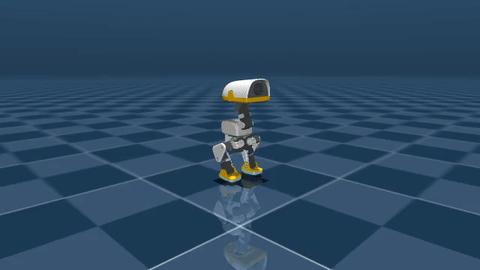

# Duck Farm 🦆 — Microduck RL on your Mac

Train reinforcement-learning policies for the
[Microduck](https://pollen-robotics.com/microduck) — Pollen Robotics'
open-source ~25 cm bipedal robot — **on an ordinary Apple Silicon Mac, no CUDA
GPU required**, and watch every policy walk, learn, and backflip live in your
browser.


| Walking (locally trained, CPU) | Backflip showcase — spotter-assisted launch, policy landing, stand handoff |
|---|---|
|  |  |

The official [microduck_rl](https://github.com/pollen-robotics/microduck_rl)
stack trains through MuJoCo Warp and needs a CUDA GPU. This project is the
**prototyping loop that runs on the laptop you already have**: same MJCF robot
model, same 61-obs / 14-action deployment contract, same 50 Hz timing — so a
behavior you invent here ports straight to the official stack for the final
sim2real training run, and the ONNX you export here is drop-in compatible with
the official tooling.

**Not affiliated with Pollen Robotics.** Two of their repos are used as
side-by-side checkouts (see setup).

## What's in the box

- **`microduck_local/`** — CPU-MuJoCo + Stable Baselines 3 PPO harness
  - `train-walk` / `train-behavior`: velocity-command walking and a library of
    teachable tricks, with mjlab-distilled rewards, symmetry augmentation,
    obs normalization, and a penalty-sign guard
  - Two actuator models: fast linearized XML servos, or the honest
    BAM XL330 voltage model (numba-fused) for maneuvers that saturate servos
  - `export-walk`: ONNX export with the obs normalizer baked in
  - `eval-walk`: headless eval battery (falls, command tracking)
  - `render-rollout`: mp4 for humans **plus a captioned frame contact sheet
    an AI assistant can read** — per-frame heights, angles, contacts
    ([example](docs/media/contact-sheet.png))
  - `bench-walk` / `bench-envs`: find the right worker count for *your* machine
  - `duck-farm`: the streaming backend that drives the browser viewer
- **`duck-viewer/`** — Next.js + react-three-fiber viewer
  - Many ducks side by side, live over WebSocket at 25 Hz; drag policy chips
    onto ducks to hot-swap brains mid-stride
  - **🎓 Teach panel**: chat a trick ("stand on one leg"), see its reward
    recipe in plain English, watch the trainee improve every ~15 s as live
    snapshots hot-load — then drag the reward sliders and fine-tune. Reward
    shaping with no Python in the loop.
  - Staged curricula for hard tricks (the backflip is 5 chained stages), with
    the viewer narrating the chain


## Quick start

Prereqs: macOS on Apple Silicon (Linux works too), [uv](https://docs.astral.sh/uv/),
Node 20+, ~3 GB of disk for the checkouts and models.

```bash
git clone <this-repo-url> duck-farm && cd duck-farm
git clone https://github.com/pollen-robotics/microduck        # shipped policies, docs
git clone https://github.com/pollen-robotics/microduck_rl     # MJCF models, official stack

cd microduck_local
uv sync
uv run --with pytest pytest tests/        # contract tests — should be all green

# train your first walking policy (a few minutes on an M-series Mac)
uv run train-walk --envs 32 --steps 3_000_000 --run-name first-gait
uv run export-walk runs/first-gait
uv run eval-walk runs/first-gait/policy.onnx

# fire up the farm + viewer
uv run duck-farm runs/first-gait ../microduck/policies/alpha_walking.onnx
cd ../duck-viewer && npm install && npm run dev   # open the printed URL
```

Then open the 🎓 teach panel and ask the duck to "stand on one leg".

## Performance (measured, Apple M-series)

The harness went through a measured optimization pass; every number below is
reproduced in [microduck_local/README.md](microduck_local/README.md) with the
methodology, including the experiments that were **rejected**:

- **~15k env-steps/s** on the real 32-env training recipe (~1.2 min per 1M
  steps); ~27k steps/s peak in throughput configs
- **One compiled MuJoCo model shared across all workers** (fork +
  copy-on-write): 64 envs dropped from **41 GB to 1.5 GB** of memory
- Semaphore + shared-memory IPC instead of pipes/pickles per step
- numba-fused BAM actuator kernels, bitwise-identical to the numpy reference
- Optional MPS (Apple GPU) PPO updates — auto-enabled only where it measured
  faster
- And the honest part: two throughput "wins" (overlapped updates, big-batch)
  raised steps/s 25–40% but **halved learning per step** in seed-matched A/Bs,
  so they're opt-in flags, not defaults. Reward-per-wall-second is the metric
  that matters.

## Teach the duck your own trick

Tricks are plain-English reward recipes in
[`behaviors.py`](microduck_local/src/microduck_local/behaviors.py) — a
`Behavior` is a set of reward terms, chat keywords, and optionally a staged
curriculum for hard maneuvers. Add one, lock it with a test, and it appears in
the viewer's teach panel with live sliders. The full playbook — contract
invariants, reward-design rules, and the verification discipline that keeps
you from fooling yourself — is in
[microduck_local/AGENTS.md](microduck_local/AGENTS.md).

## Working with AI assistants

This repo is set up for agentic coding tools:

- **`AGENTS.md`** (root and per-project) — the workspace map and the training
  playbook, in the cross-tool convention used by Claude Code, Codex/ChatGPT,
  and most open-source agents. `CLAUDE.md` includes it for Claude Code.
- **`.claude/skills/render-rollout/`** — a skill that teaches an agent to
  *look at* what a policy actually does (render + read the contact sheet)
  before believing reward curves. It reads as plain documentation for any
  agent, human included.

## Sim2real, honestly

This harness is for **prototyping** — minutes-long feedback loops on reward
design, observations, curricula. It runs a subset of the official stack's
domain randomization, so don't ship its policies to a real robot. Once a
behavior works here, port the env design to an mjlab cfg in `microduck_rl` and
retrain on GPU (that repo's `AGENTS.md` is the sim2real recipe). Everything
here keeps the deployment contract so that port is mechanical.

## License

Apache-2.0 (same as the upstream Microduck repos). Not affiliated with or
endorsed by Pollen Robotics; "Microduck" is their project.
