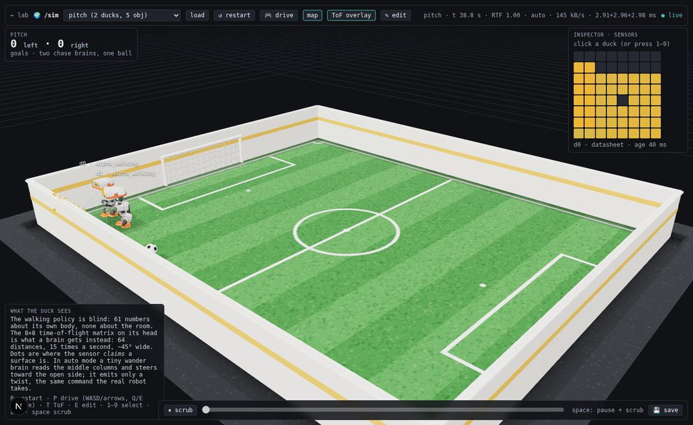
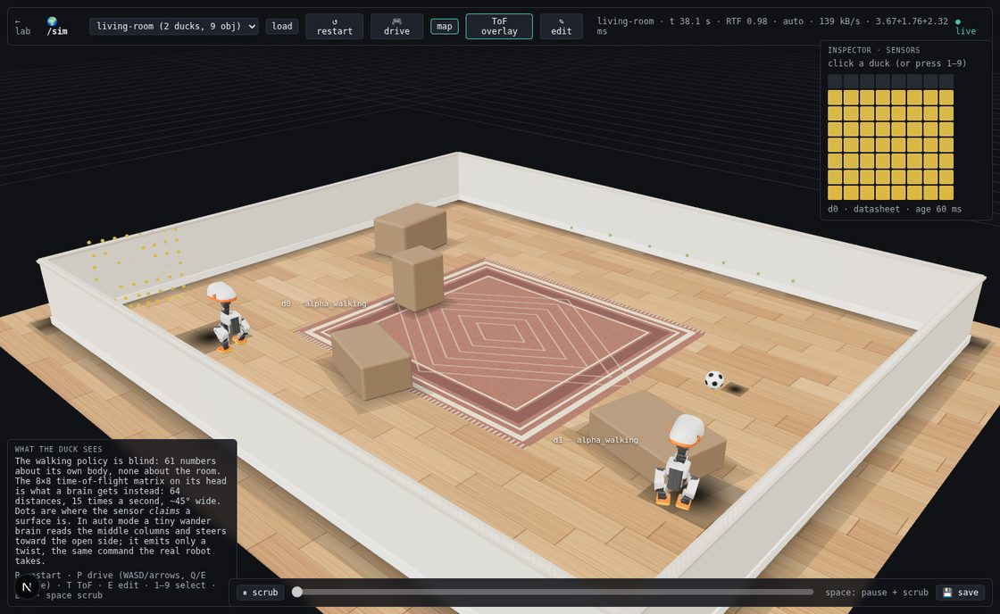
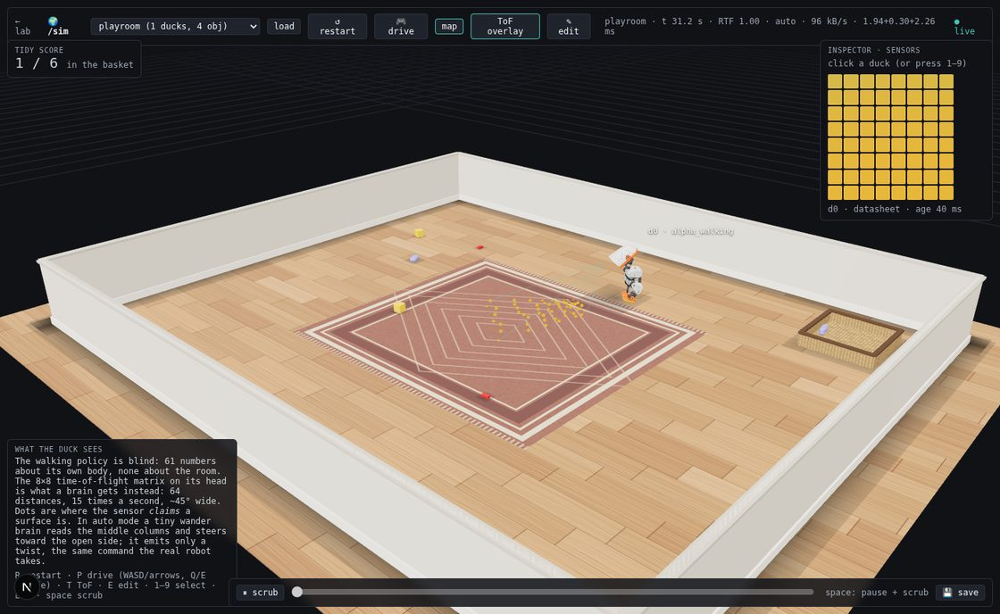

# duck-viewer

Next.js + Three.js (react-three-fiber) web viewer for Microduck policies — watch
many training runs walk side by side in the browser instead of the native MuJoCo
viewer. The pattern is lifted from jenga-stacker's web viewer (mesh geometry
extracted straight from the compiled MuJoCo model, no asset pipeline), upgraded
from recorded replays to live WebSocket streaming.

```
┌──────────────────────────┐  GET /scene (meshes + colors, once)  ┌────────────┐
│ duck-lab (Python)       │ ───────────────────────────────────▶ │ Next.js    │
│ microduck_local          │   WS /ws ~25 Hz body poses + stats   │ duck-viewer│
│ one CPU-MuJoCo env per   │ ◀─────────────────────────────────── │ r3f canvas │
│ policy, real-time 50 Hz  │   {"cmd": [vx,vy,wz]} / {"reset"}    │ + HUD      │
└──────────────────────────┘                                      └────────────┘
```

## Run it

```bash
# 1. the lab (from microduck_local/) — each arg is one duck
uv run duck-lab --checkpoints runs/first-gait ../microduck/policies/alpha_walking.onnx

# 2. the viewer
cd duck-viewer && npm run dev     # then open the printed localhost URL
```

```bash
npm test        # vitest: the canvas arithmetic (lib/*.test.ts). CI runs it.
```

Unit tests here cover the maths that decides *which pixels get asked for* —
they cannot tell you the page looks right. For that, look at it:
`.claude/skills/sim-smoke` brings the lab and viewer up and screenshots
`/sim`.

`?lab=host:port` on the page URL points it at a different lab (a scratch
server on another port, a scratch lab on another port — the lab binds loopback, so same machine); default `127.0.0.1:8788`.

Duck sources: a run dir (`runs/my-run`, uses/exports `policy.onnx`), any
`.onnx` file (shipped alphas work), or `--checkpoints <run>` to line up one
duck per training checkpoint — watching a policy learn across 500k-step
snapshots is the point of this thing.

**Ducks are driven only by their RL policies** — no teleop. Walking policies
follow the server's auto demo script (their velocity-command input, the same
interface the real robot's gamepad uses); trick policies (`teach-*`, 🎓, 🤝)
get zero commands and just do their trick. The **keyboard flies the camera**,
Maya/Blender-style: drag to orbit, scroll/two-finger-vertical to zoom,
**two-finger horizontal swipe** to slide laterally (natural-scrolling
direction; browser back-swipe is suppressed over the scene, and panels keep
native scrolling), **A/D** slide, **W/S·↑↓** dolly, **←/→** orbit, **Q/E**
rise/fall, **Shift+R** reset view — all held keys move smoothly (velocity × dt).
The one non-camera key is **R**, which **restarts the sim** (`{"reset": true}`
to the lab): every duck's episode drops back to step zero at the same moment,
which is what makes a side-by-side comparison legible. **Clicking a duck**
(or its HUD row) **selects it** — amber floor ring + highlighted row — and
**Delete/Backspace removes it** (same `remove_duck` message as the row's ✕);
**Esc** or an empty-floor click deselects. Selection uses the same projected
screen-radius hit test as policy assignment, not raycasting. Selecting a duck
that runs one of our trained runs also **loads that run into the 🎓 teach
panel** (`POST /teach/load` — recipe card + sliders in finished state, so
"✨ fine-tune" continues from that exact brain); shipped Pollen policies are
skipped quietly, and nothing is loaded while a job is actively training. HUD shows per-duck
episode time, fall count, reward-rate EMA (dimmed for trick ducks — it scores
the walking recipe), a system-stats strip (cpu/mem/training steps-per-second),
and collapses to a pill via its — button. Its 🏷 button toggles the floating
duck name labels (persisted; the selection ring stays either way). Labels
stack below every overlay panel (panels sit at z-index 20, labels top out
at 10), so a crowded farm can't scribble text over the HUD or chip lists. (Manual drive commands still exist
at the protocol level — `LabClient.sendCmd` — for a future gamepad page;
the UI deliberately doesn't expose them.)

## The panels

- **🧠 policies** (top-right): every assignable brain — shipped Pollen
  policies, local runs, checkpoints. Drag a chip onto a duck (or click to arm,
  then click a duck) to hot-swap its brain mid-stride; drag it to empty floor
  — or just **double-click the chip** — to spawn a fresh duck running that
  policy; drop it (or armed-click) **on the 🎓 teach panel** to load that
  run's recipe there for refinement instead. Auto-refreshes when a training
  run finishes. Hovering one of **our runs** reveals a ✕ that deletes that
  run's training data from disk — the exported policy, its checkpoints and
  its progress log; a curriculum chain deletes as one family, all stages at
  once. It always confirms first (naming the run dirs and the space it
  frees), and the lab refuses outright while that run's job is still
  training. Shipped Pollen policies have no ✕ — they aren't ours to delete.
- **🎓 teach the duck** (bottom-right): chat a trick ("stand on one leg"), see
  the reward recipe in plain English, watch the live score curve + per-term
  bars while the 🎓 trainee duck improves snapshot by snapshot. When a run
  ends, the recipe's **weight sliders unlock**: drag them and either
  "↻ retrain" (fresh) or "✨ fine-tune" (keep what it learned, adjust) —
  that's the reward-shaping loop with no Python involved.
- **🎬 animate** (bottom-center): keyframe editor for the robot — pose the
  translucent ghost duck (sliders, or drag body parts in the scene), key poses
  on the timeline, save the clip, ⚡ train a policy to track it. The **🎮 rig**
  section on top gives game-style macro controls over coupled joints — squat,
  lean, per-leg L/R swing (a stride, feet kept level), sway, stance, twist,
  toes, look — each a fixed coupling that keeps the
  feet flat (e.g. squat folds hip pitch + knee + ankle on both legs); the ⇕
  handle drags the selected rig control (squat when none is selected) and
  parks at that control's anchor on the duck — head for look, thigh for a
  swing — wearing the control's name. A
  🦴 joints / 🎮 rig toggle picks what clicking the duck edits: one servo, or
  the part's rig control (feet→toes, thigh→swing, shin→squat, trunk→lean,
  head→look, hip yaw→twist, hip roll→sway) — the whole coupling lights up and
  the drag is geared so the grabbed part tracks the cursor; selecting a rig
  slider highlights and arms that control the same way. Rig
  slider ranges are computed live from the MJCF servo limits: the slider ends
  exactly where the first servo runs out of travel, and the tooltip names it.
  Rig directions are mutually orthogonal in joint space, so controls never
  move each other's sliders, and asymmetric hand-tweaks survive a rig drag.
- **📷 shot** (top-center, always available): one click downloads a full-res
  PNG of the current view, named after the selected duck (or `duck-lab` for a
  crowd shot) — the selection ring is hidden for the capture render, and the
  whole render→read→download runs synchronously inside the click so Chrome
  never blocks it as an "automatic" download. The panel centers at the top
  but slides right of the duck-lab HUD when that panel is wide (long duck
  names) — the HUD publishes its right edge through the ui.ts store.
- **🎥 record** (same panel, appears when a duck is selected): one click films
  the selected duck for you — the camera glides to a ¾ front shot (chosen from
  the duck's heading, then held with a slow cinematic drift; OrbitControls and
  camera keys pause for the take) and MediaRecorder captures the WebGL canvas.
  Footage is automatically clean: DOM labels/panels aren't part of the canvas,
  and the amber selection ring hides itself while filming. ■ stop uploads the
  take to the lab (`POST /captures`), whose bundled ffmpeg writes a
  full-resolution h264 **mp4** and a 480 px palette **gif** into
  `microduck_local/captures/`; the panel then offers ⬇ downloads of both.
  Takes cap at 60 s. Frames are pushed per RENDERED frame
  (`captureStream(0)` + `requestFrame()` — automatic capture rides the
  compositor and records almost nothing in a throttled tab), so keep the tab
  visible while recording; a take where the scene never rendered is refused
  with a message instead of producing a 0.1 s "video".
- **helpers**: ＋ on the training row spawns a 🤝 helper duck — another
  viewer of the same live policy. Helpers do **not** add trainer workers
  (that *lowered* steps/s while the lab was open). ✕ removes it.

Panel states, chat history, and the camera persist in localStorage; the duck
roster itself persists server-side (`microduck_local/lab-state.json`) across
lab restarts.

## `/sim`: the world page

`http://localhost:63317/sim` renders the lab's **world mode** (start the lab
with `uv run duck-lab --world living-room`, or load a scenario from the
page's picker). One room, many ducks, and what each duck senses:

- **Scenario picker + load** (top bar): built-ins and anything saved under
  `microduck_local/scenarios/`. Walls, static boxes and the floor come from
  the scenario JSON; balls and free boxes stream their poses at 25 Hz.
- **ToF overlay** (`T`): one dot per zone of each duck's 8×8 depth matrix,
  at the depth the sensor *reports*, colored near→far amber→teal, plus the
  four corner rays from the aperture. Select a duck (click, or `1`–`9`) to
  see only its fan.
- **Chase overlay** (under `T` too, on a pitch): what each chase brain
  thinks about the ball, drawn on the floor in its own odometry frame like
  the map — an orange line from the ball track to where the brain predicts
  it will stop (its head yaws that way and its hunt aims there), a grey
  ring on the ball memory its search would walk to, a teal ring on its
  line-up / push spot. Every chase duck, the selected one bright. The pitch
  panel splits the goals into kicked (within 4 s of a kick) and walked in,
  the same attribution `eval-pitch` prints.
- **Inspector** (right): the selected duck's heatmap painted straight off the
  stream, frame age (amber when stale), a noise preset select (`ideal` /
  `datasheet` / `hostile`, applied live), and which brain is steering it.
- **Cam** (`V`): under the inspector, what the selected duck's head camera
  sees, rendered from the `head_camera` site at the detector's field of view
  (62°×48°), with the detector's output drawn over it as boxes — a bearing,
  an elevation and an apparent width per thing it found, and nothing else
  about the picture. That is what a brain gets, and why a floor ball
  vanishes from the frame in the last 0.3 m unless the head pitches down.
  The inset is rendered from the camera pose the frame was *captured* from
  (the stream carries it), not from where the head is now: at 10 Hz plus
  latency the walking head moves the picture by up to a fifth of its width
  before a brain gets the frame — measured, and the lag a brain acts on.
  It is a second, scissored pass of the same scene in the same canvas (a
  priority-1 `useFrame` takes the render loop over), not a render target and
  a readback; the sensor drawings (ToF dots, rays, map) sit on a layer the
  head camera does not see. The scissor rectangle goes to three in **CSS
  pixels** — `setScissor`/`setViewport` scale by the renderer's pixel ratio
  themselves, so measuring the box in device pixels applies it twice. That
  shipped: on a retina Mac the pass landed 1.5× off the panel, so the inset
  showed the main orbit view straight through a transparent div (labels and
  boxes intact, no picture) and the main view came back zoomed 1.5×. The
  arithmetic lives in `lib/inset.ts` and is pinned by `lib/inset.test.ts`.
- **Drive** (`P`, then WASD/arrows, Q/E strafe): every duck takes your twist
  for 6 s after the last key; otherwise ToF-equipped ducks wander on the
  lab's `Wander` brain and blind ducks follow a demo script. `R` restarts.
- **Inspector · brain**: which brain steers the selected duck (`wander`,
  `follow`, `tidy`, `script`, or a trained `learned:<run>`), switchable live,
  its inputs with their ages (ToF, detector, the target it is tracking), its
  current intent, and — for `tidy` — picked/delivered counts and the toys it
  gave up on. `head` toggles whether the brain's head intents are applied.
- **Persons + possess**: scenarios can carry walking persons (mocap capsules
  on waypoint paths). Possess one from the inspector and drive it with the
  same keys; the ducks keep their brains. This is how follow-me is tested.
- **Editor** (`E`): place walls (two clicks), boxes, balls, ducks, persons,
  toys and the basket on the floor, set each duck's brain, then save-and-load
  under a name (`PUT /scenarios/{name}`; built-ins are read-only, so a draft
  of one saves as a copy).
- **Map** (`M`): the selected duck's occupancy grid, painted on the floor —
  what it believes the room is, from its ToF frames and its own odometry
  (amber occupied, teal free). Switch its `odom` preset in the inspector to
  `datasheet` or `hostile` and watch the map smear like a real robot's.
- **Perf** (top bar): the lab's cost per 20 ms tick as physics+policies +
  sensors + frame encode, next to RTF and kB/s.
- **Pitch score** (top-left, `pitch` / `pitch-2v2` / `pitch-3v3`): goals per
  side while the `chase` brains go after one ball; in a team each duck's
  inspector shows its role (attack / support) and the team's blackboard.
- **Tidy score** (top-left, `playroom` scenario): toys in the basket, what the
  duck is carrying, picks and deliveries — the same numbers `eval-tidy`
  prints headless.
- **Timeline** (bottom): the lab keeps a ring buffer of recent frames; pause
  and scrub, or save the buffer as a recording.
- Protocol: `lib/sim.ts` (`/ws/sim` frames, `/scenarios`, `/world`).

The ducks are rendered by the main page's `Duck` component unchanged (merged
geoms per body, DOM labels), which is why world frames carry the world body
first, as `GET /scene` lists bodies. Everything else in the room is
`components/SimStage.tsx`, which dresses the scenario JSON without changing
what the lab simulates:

- **Pitch** (`goal_width > 0`): a mown grass floor with the markings sized to
  the room — touchlines, halfway line, centre circle, goal areas, penalty
  spots, corner arcs — a dark apron outside white rink boards with an amber
  stripe, and goal frames with nets on both short walls exactly where
  `World` counts a goal. The ball wears a 32-panel skin so you can see it
  roll.
- **Rooms** (`living-room`, `playroom`, `follow-me`, anything you draw in the
  editor): oak planks, plaster walls with a baseboard and a cap, a rug in the
  middle of the room, bevelled furniture on soft footprint shadows, a wicker
  basket with a bound rim, studded bricks / bevelled blocks / rolled socks.
- **Grounding without shadow maps**: one instanced mesh of multiply-blended
  contact blobs follows every duck, ball, toy, box and person (fading and
  spreading as the thing lifts off the floor), and a darkening strip runs
  along every wall base. A procedural `RoomEnvironment` PMREM on
  `scene.environment` gives the shells and the ball their highlights.
- Every texture is painted on a canvas at load (no image assets, no
  fetches); the scenario-sized ones are rebuilt only when the floor, the
  walls' extent or the goal width change, not on every edit click.





## `/train`: brain training runs

`http://localhost:63317/train` charts `train-brain` runs live.

`train-brain` is a plain CLI process — it never talks to the lab — so a brain
run used to be invisible while a `/teach` job was watchable. The lab's
`GET /brains` reads the artifacts the trainer already writes
(`brains/<run>/brain.json` and `progress.jsonl`) and this page polls it every
2 s. Nothing here can start, steer or stop a run: it is a read of the disk.
That also means it picks up a run started before the page was opened, and
keeps the curve of one that has already finished.

- **Run list** (left, the only scrolling region on the page — the page itself
  is fixed to the viewport). One card per directory in `brains/`: progress
  bar, steps done against the budget, last reward, elapsed, ETA, steps/s, and
  the contract tags from `brain.json` (`variety`, `obs v2`, envs, seed). A
  live run is marked `● live`; a finished one that exported is `shipped`.
- **Chart** (right). Bold line is a 9-rollout trailing mean, faint line the
  raw per-rollout value, toggled between episode reward and episode length.
  Hover for a crosshair: a rule at the hovered step and a readout of every
  charted run's value there. A run that had already stopped by that step is
  greyed and labelled with the step it ended at, rather than showing its
  final value as though it were current.
- Click a card to focus it; click its swatch to add or remove it from the
  chart. `all` / `none` toggles everything.

A brain cloned from the repo shows *no curve* — only `brain.onnx` and
`brain.json` are committed, `progress.jsonl` stays local — and the card says
so rather than reading as a broken run.

## Notes for future work

- The scene payload is ~20 MB raw (gzipped over the wire, one-time). If it ever
  matters: quantize verts or move to binary/Draco.
- Poses stream as JSON at 25 Hz (~16 bodies × 7 floats per duck) — binary
  framing is the next lever, far from needed at this scale.
- Rendering stays deliberately light: geoms merged per body (~16 draw calls per
  duck), no shadow maps, DOM labels. The first version (560 shadow-casting
  meshes + drei `Text` GPU glyph atlases) lost the WebGL context in the
  embedded browser — keep an eye on `THREE.WebGLRenderer: Context Lost` if you
  add GPU-heavy effects back. The `/sim` stage's fidelity (SimStage.tsx) is
  all canvas textures, one PMREM and one instanced blob mesh for that reason:
  a room costs a few dozen draw calls regardless of how many ducks are in it.
  Two three.js gotchas met on the way: `MultiplyBlending` needs
  `premultipliedAlpha` on the material, and `mergeGeometries` refuses a mix
  of indexed and non-indexed parts (flatten with `toNonIndexed()` first).
- Duck colors are the MJCF material rgba streamed per geom, carried through the
  per-body merge as a vertex-color channel (so per-part color costs zero extra
  draw calls). `Duck.tsx` keeps a by-name override table (`MATERIAL_FIX`)
  for materials an export gets wrong; the 2026-09 upstream CAD re-export
  carries the right colours itself, so the table is empty today. Against a
  lab too old to stream colors the viewer falls back to one guessed color
  per body.
- The lab loop is single-threaded Python: 8 ducks × 50 Hz ≈ 5% of one core.
  Dozens of ducks are fine; hundreds would want the envs in a worker pool.
